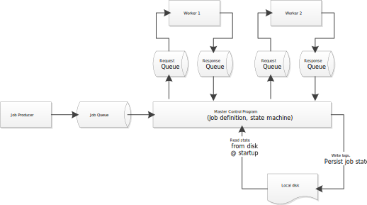

Master Control Program
======================

Master Control Program is a sample implementation of a distributed worker and
centralized workflow state machine.  The purpose of this sample implementation
is to bootstrap teams that can benefit from this pattern with working code so
that they can quickly start implementing business logic, providing capabilities
without having to deal with the plumbing of implementing the pattern.


System architecture diagram
---------------------------


Capabilities
-----------------------------------------------------
### Horizontal scalability
Because workers are "dumb" and know only about the message queue from where
they should accept work, and because of the queueing abilities in RabbitMQ,
this system can scale out workers horizontally to complete more work
simultaneously.
### Dependability
Because job state is stored in the MCP, and because worker messages are
acknowledged only when a work item has been completed, when a worker process
dies, or the underlying OS or hardware the worker is running on dies, work
is redistributed to other available workers.  If no workers are available,
then state is persisted until a worker becomes available and the jobs
continue where they left off.
### Separation of concern
The idea is that each worker does one thing and does that one thing well.
This is the UNIX philosophy of small, simple tools that are composable to
build more complex functionality.


Dependencies
------------
This system takes dependencies on the following 3rd party software:

### [RabbitMQ](https://www.rabbitmq.com/)
* RabbitMQ is an open source message queue system.  It was chosen for a few
reasons:
    * It runs on both Linux and Windows
    * It is easy to use
    * It is already [supported by the Morningstar core services team](https://mswiki.morningstar.com/pages/viewpage.action?pageId=131959800)
    * It can be run in a [Docker container](https://hub.docker.com/_/rabbitmq/) for ease of local development.

```bash
$ docker run -d --hostname my-rabbit --name rabbitmq -e RABBITMQ_DEFAULT_USER=user -e RABBITMQ_DEFAULT_PASS=password rabbitmq:3.6.1-management
```

### [Stateless](https://github.com/dotnet-state-machine/stateless)
* Stateless is an open source library providing state machine based workflows
defined in .NET code, and was chosen for its ease of use.

Building
--------
Visual Studio 2015 is required to build this project, and the target is .NET
Framework 4.6.X.